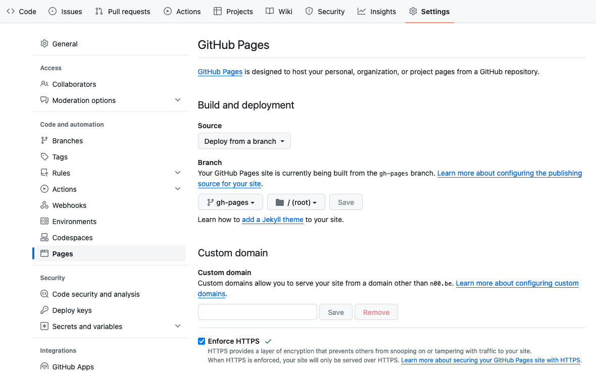

# SANS Holiday Hack Challenge Template

## About

This is the template I've used for my 2020, 2021, and 2022 SANS Holiday Hack Challenge submissions. It's based on [MkDocs](https://www.mkdocs.org) and the [MkDocs Material](https://squidfunk.github.io/mkdocs-material/) theme. The website based on this template and examples of winning reports and their repositories can be found at:

| Report website                                                  | GitHub repository                                       | Final score                                                                                     |
| --------------------------------------------------------------- | ------------------------------------------------------- | ----------------------------------------------------------------------------------------------- |
| [Report template](https://n00.be/HolidayHackChallengeTemplate/) | https://github.com/crahan/HolidayHackChallengeTemplate/ | -                                                                                               |
| [2020 submission](https://n00.be/HolidayHackChallenge2020/)     | https://github.com/crahan/HolidayHackChallenge2020      | [Best technical answer](https://www.holidayhackchallenge.com/2020/winners_answers.html)         |
| [2021 submission](https://n00.be/HolidayHackChallenge2021/)     | https://github.com/crahan/HolidayHackChallenge2021      | [Grand prize winner](https://www.sans.org/mlp/holiday-hack-challenge-2022/winners-and-answers/) |
| [2022 submission](https://n00.be/HolidayHackChallenge2022/)     | https://github.com/crahan/HolidayHackChallenge2022      | [ESNET award](https://www.sans.org/mlp/holiday-hack-challenge-2022/winners-and-answers/)        |

## Setup

### Set Up Your Python Environment

1. Make a copy of this repository in your own GitHub account and configure it as _Private_. Forking the repository won't work because a forked repository's visibility can not be changed to _Private_.
2. Clone the copy of the repository to your computer using `git clone <repository_url>`.
3. Navigate into the folder using `cd <cloned_folder_name>`.
4. Create a Python virtual environment using `python3 -m venv venv`.
5. Activate the environment using `. ./venv/bin/activate` (for a Bash shell environment).
6. Install the Python package dependencies using `pip install -r requirements`.
7. Run `mkdocs serve` to start a local copy of the website at `http://127.0.0.1:8000/`.

### Add Your Content

Details such as the site name, site author, and contents of the sidebar navigation are configured in the [`mkdocs.yml`](mkdocs.yml) file. The write-up itself and associated assets are located in the [`docs`](docs/) folder. The default configuration stores the write-up for each objective in a `docs/objectives/oX.md` file and associated images for that objective in a `docs/img/objectives/oX/` folder. As you add content and make changes to files, MkDocs will automatically update the local copy of the website at `http://127.0.0.1:8000/`.

**Note**: More information on how to make changes to MkDocs settings or the Material theme configuration is available at https://www.mkdocs.org/user-guide/writing-your-docs/ and https://squidfunk.github.io/mkdocs-material/reference/, respectively.

### Publish Your Report

**IMPORTANT**: Make sure to configure your copied GitHub repository as _Private_ while SANS Holiday Hack Challenge is ongoing. This way, no solutions or spoilers are accidentally leaked to the public!

Once the submission deadline has passed you are free to share your finalized report with the world. Run the `mkdocs gh-deploy` command in a terminal to create all the required HTML assets and push them to a `gh-pages` branch on GitHub. To serve the HTML content as a website go the _Pages_ section in the GitHub settings for the copied repository, select _Deploy from a branch_ for the _Source_ and make sure the _Branch_ is set to _gh-pages_.

After a few minutes your write-up will be live at `https://<username>.github.io/<repository>`, with `<username` your GitHub username and `<repository>` the name of your GitHub repository where you copied the [HolidayHackChallengeTemplate](https://github.com/crahan/HolidayHackChallengeTemplate/) project to.
